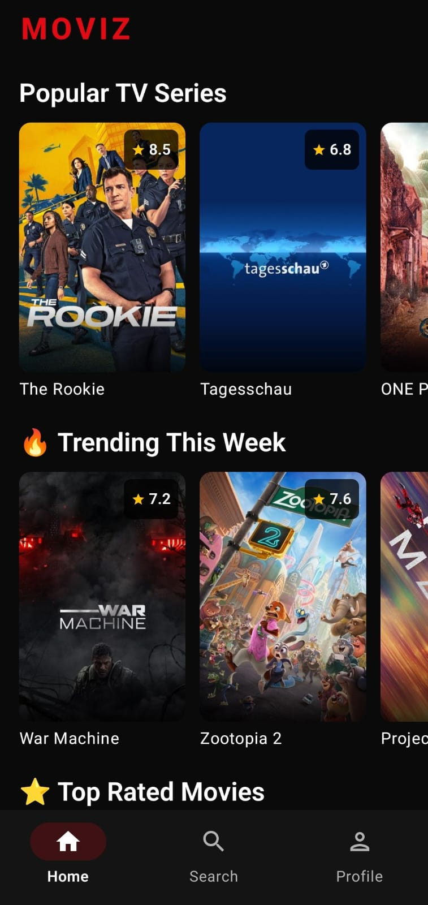
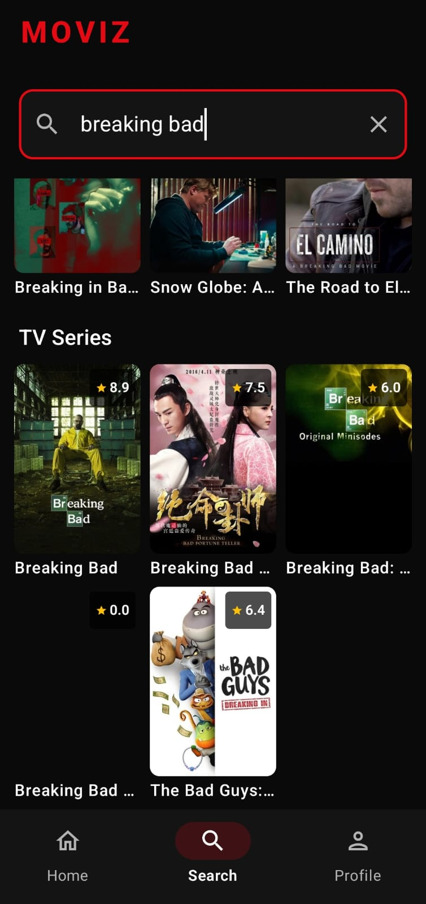
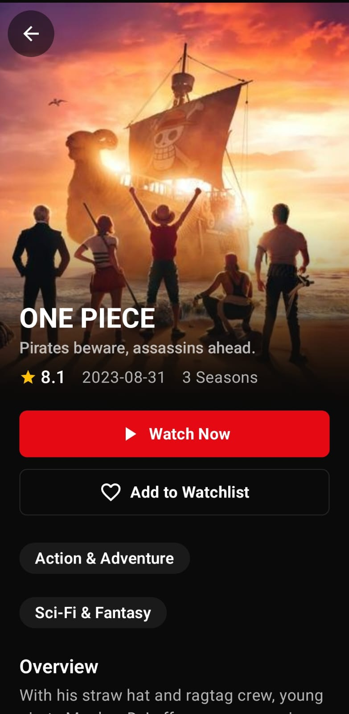
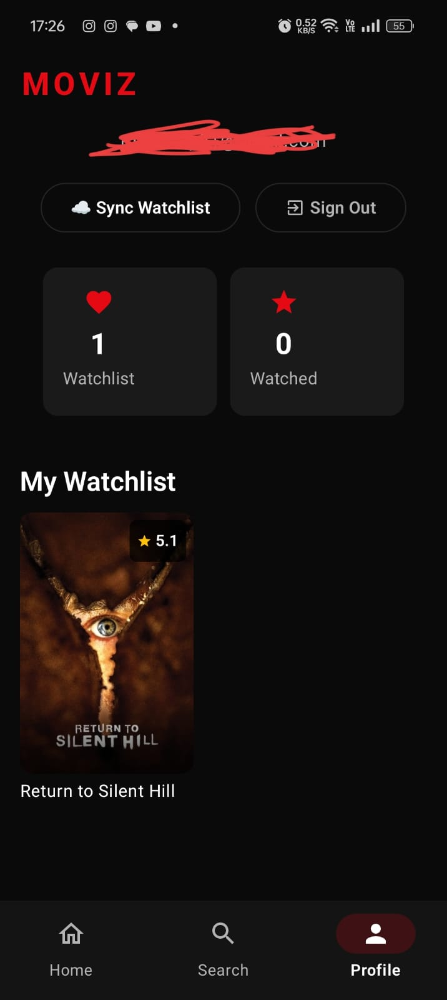

# 🎬 MovizApp

<div align="center">

  
  
  
  
  

</div>

<div align="center">
  
  
  
  
</div>

<br />

<div align="center">
  <b>A Netflix-inspired movie & TV show browsing and streaming app built entirely with Kotlin & Jetpack Compose.</b>
</div>

---

## 🚀 About

**MovizApp** is a feature-rich **Android movie and TV show browsing & streaming app** built completely with **Kotlin & Jetpack Compose**.

It fetches popular Movies and TV Shows from the **TMDB API**, presenting them in a highly polished, **Netflix-inspired dark theme** UI. The app features horizontal poster carousels, a powerful search engine, detailed show/movie info with cast & seasons, and a built-in streaming player using **VidKing** — complete with aggressive ad & popup blocking via WebView.

---

## 📸 Screenshots

<div align="center">
  <table>
    <tr>
      <td align="center"><b>🏠 Home Screen</b></td>
      <td align="center"><b>🔍 Search Screen</b></td>
      <td align="center"><b>📄 Detail View</b></td>
    </tr>
    <tr>
      <td></td>
      <td></td>
      <td></td>
    </tr>
    <tr>
      <td align="center"><b>▶️ Player Screen</b></td>
      <td align="center"><b>👤 Profile Screen</b></td>
      <td></td>
    </tr>
    <tr>
      <td></td>
      <td></td>
      <td></td>
    </tr>
  </table>
</div>

---

## ✨ Features

| Feature | Description |
|---------|-------------|
| 🍿 **Browse Movies & TV Shows** | Discover popular, top-rated, trending, now playing, and upcoming content powered by TMDB API |
| 🎨 **Netflix-Inspired Dark UI** | Professional and immersive streaming-service aesthetic with curated design tokens |
| 🎬 **Horizontal Poster Carousels** | Browse vast collections effortlessly on the home screen with snappy, scrollable carousels |
| 🔍 **Dedicated Search Screen** | Instantly find your favorite movies and shows with a beautiful poster grid layout |
| ▶️ **Integrated VidKing Player** | Stream content directly inside the app with intelligent, aggressive ad & popup blocking |
| 📺 **Detailed Information** | View full overviews, cast, seasons, and genre tags with smooth Read more / Read less toggle |
| 👤 **Profile & Watchlist** | Firebase-powered user profiles with cloud-synced watchlist across devices |
| 🔐 **Google Sign-In** | Seamless authentication via Google Credential Manager |
| ❤️ **Watchlist Management** | Add/remove movies and shows to your personal watchlist |
| ⭐ **Ratings Display** | Star ratings displayed on every poster card |

---

## 🏗 Architecture & Tech Stack

Built with **MVVM (Model-View-ViewModel)** architecture, dependency injection, and clean separation of concerns.

```
📦 MovizApp
├── 📂 data
│   ├── 📂 model          # Data classes (Movie, TvShow, MovieDetails, etc.)
│   └── 📂 local          # Room Database (DAO, Entity, DB)
├── 📂 Repository          # Single source of truth — coordinates API & local DB
├── 📂 retrofit            # Retrofit API service & network setup
├── 📂 viewmodel           # MovieViewModel — business logic & state management
├── 📂 screens             # Composable screens (Home, Search, Detail, Player, Profile)
├── 📂 di                  # Hilt dependency injection modules
└── 📂 auth                # Firebase + Google Sign-In authentication
```

### 🛠 Tech Stack

| Layer | Technology |
|-------|------------|
| **UI** | Jetpack Compose, Material 3, Accompanist FlowLayout, Lottie Compose |
| **Networking** | Retrofit 2, Gson Converter |
| **Image Loading** | Coil |
| **Asynchrony** | Kotlin Coroutines & Flow |
| **Local Storage** | Room Database |
| **Navigation** | Jetpack Navigation Compose |
| **DI** | Hilt (Dagger) |
| **Authentication** | Firebase Auth, Google Sign-In (Credential Manager) |
| **Cloud Storage** | Firebase Firestore (watchlist sync) |
| **Web & Video** | AndroidX WebKit (VidKing player with ad-blocking) |

---

## ⚡ Setup Instructions

### Prerequisites

- **Android Studio** Hedgehog (2023.1.1) or later
- **JDK 17**
- **Android SDK** with API Level 36 (compile) / API 29+ (min)
- A **TMDB API Key** — [Get one free here](https://www.themoviedb.org/settings/api)

### 1. Clone the repository

```bash
git clone https://github.com/rookiecoder910/movizApp.git
cd movizApp
```

### 2. Configure API Keys

> ⚠️ **Important:** API keys are stored in `local.properties` which is **never committed** to version control.

Open (or create) `local.properties` in the **project root** and add:

```properties
# Already present:
sdk.dir=YOUR_SDK_PATH

# Add these lines:
TMDB_API_KEY=your_tmdb_api_key_here
GOOGLE_WEB_CLIENT_ID=your_google_web_client_id_here
```

The build system reads these values at compile time via `BuildConfig`, so **no secrets are ever hardcoded in source code**.

### 3. Open in Android Studio

- Launch Android Studio → `Open an Existing Project` → select the cloned `movizApp` directory.

### 4. Build & Run

- Click **Sync Project with Gradle Files** (🐘 icon).
- Hit **Run** (`Shift + F10`) to deploy on your emulator or physical device (Min SDK 29 / Android 10).

---

## 🔐 Security

This project follows best practices for API key management:

- ✅ API keys are stored in `local.properties` (gitignored by default)
- ✅ Keys are injected via `BuildConfig` at compile time
- ✅ `.env` and `*.env` files are also gitignored
- ✅ `google-services.json` should be kept private (add to `.gitignore` if sharing publicly)
- ❌ **Never** commit API keys directly in source code or `build.gradle` files

---

## 📱 Screens Overview

| Screen | Description |
|--------|-------------|
| **Home** | Horizontal carousels for Popular TV Series, Trending This Week, Top Rated Movies, Now Playing, Upcoming, and more |
| **Search** | Full-text search across movies and TV shows with poster grid results |
| **Movie/TV Detail** | Backdrop image, overview, rating, release date, genres, cast, seasons, Watch Now & Add to Watchlist buttons |
| **Player** | Embedded VidKing WebView player with aggressive ad/popup blocker |
| **Profile** | User info, watchlist count, watched count, synced watchlist display, and sign-out |

---

## 🤝 Contributing

Contributions are welcome! Feel free to open issues or submit pull requests.

1. Fork the repo
2. Create a feature branch (`git checkout -b feature/amazing-feature`)
3. Commit your changes (`git commit -m 'Add amazing feature'`)
4. Push to the branch (`git push origin feature/amazing-feature`)
5. Open a Pull Request

---

## 📄 License

This project is open-source. See the [LICENSE](LICENSE) file for details.

---

<div align="center">
  <b>Made with ❤️ using Kotlin & Jetpack Compose</b>
  <br />
  <sub>If you found this project helpful, consider giving it a ⭐!</sub>
</div>
